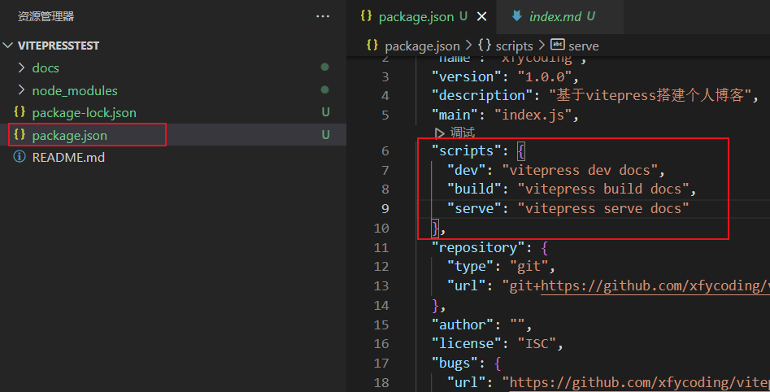
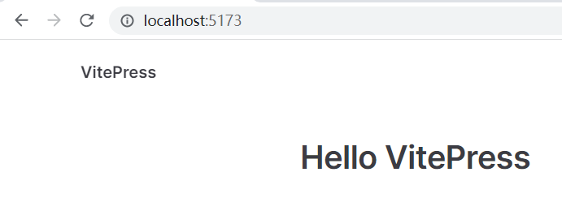
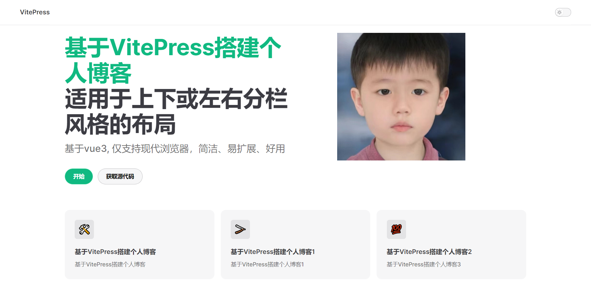

# 基于VitePress搭建个人博客

## vitepress 官网

[vitepress 官网 (请优先看英文官网)](https://vitepress.vuejs.org/)

[vitepress 中文翻译网站 (中文翻译网站内容是残缺的)](https://vitejs.cn/vitepress/)

## 快速搭建VitePress

- **步骤 1:**创建并进入一个目录

  ```sh
  $ mkdir vitepress-starter 
  $ cd vitepress-starter
  ```

- **步骤 2:** 初始化

  ```sh
  $ npm init
  ```

- **步骤 3:** 本地安装 VitePress

  ```sh
  $ npm add --dev vitepress
  ```

- **步骤 4:** 创建你第一篇文档

  ```sh
  $ mkdir docs 
  $ CHCP 65001
  $ echo '# Hello VitePress' > docs/index.md
  ```

- **步骤 5:** 在 `package.json`.添加一些`script`

  ```sh
  {
    "scripts": {
      "dev": "vitepress dev docs",
      "build": "vitepress build docs",
      "serve": "vitepress serve docs"
    }
  }
  ```

  

  具体位置如下图：

  

- **步骤 6:** 在本地服务器上启动文档站点

  ```sh
  $ npm run dev
  ```


到这一步就已经搭建好了，如果有乱码，修改相对于的文件编码即可，最终效果图如下：




## 配置vitepress

### 项目结构

```sh
.
├─ docs
│  ├─ .vitepress
|  |  ├─ components (可选的) 
|  |  ├─ theme (可选的)
|  |  |  └─ index.js
│  │  └─ config.js
|  ├─ public (可选的)
│  └─ index.md
└─ package.json
```

这是主要文件夹的功能分析：

1. `.vitepress` 主要处理全局配置以及自定义主题

   > 以下是config.js 默认初始代码，建议直接复制
   >
   > ```js
   > export default {
   >     // 定义在浏览器标签上显示的标题
   >     title: "xfycoding",
   >     // 大部分主要的主题配置都在里面了
   >     description: '一枚努力学习的程序员',
   >     //根路径
   >     base: '/blog/',
   >     //开启最后编辑时间
   >     lastUpdated: true,
   >     themeConfig: {
   >        //网页logo
   >        logo: '/img/home/Xfycoding.jpg',
   >        // 导航上显示的内容
   >        siteTitle: 'XfyCoding博客',
   >        // 配置顶部的文字(不配置则是英文)
   >        outlineTitle: '文章目录',
   >        // 表示显示h2-h6的标题
   >        outline: 'deep',
   >        //最后编辑时间内容
   >        lastUpdatedText: 'Updated Date',
   >        socialLinks: [
   >          { icon: "github", link: "https://github.com/Xfycoding" }
   >        ],
   >        //页脚
   >        footer: {
   >          message: 'XfyCoding',
   >          copyright: 'Copyright ©2023-present XfyCoding 版权所有'
   >        },
   >        //上（下）一篇
   >        docFooter: {
   >          prev: '上一篇',
   >          next: '下一篇'
   >        },
   >        // //导航栏
   >        // nav: [
   >        //   { text: '首页', link: '/' },
   >        //   { text: '搭建个人博客', link: '/articles/搭建个人博客/基于VitePress搭建个人博客' },
   >        //   {
   >        //     text: '下拉菜单',
   >        //     items: [
   >        //       { text: '项目A', link: '/articles/下拉菜单/a' },
   >        //       { text: '项目B', link: '/articles/下拉菜单/b' }
   >        //     ]
   >        //   },
   >        //   {
   >        //     text: '分组下拉菜单',
   >        //     items: [
   >        //       {
   >        //         // 可以省略标题
   >        //         text: '标题A',
   >        //         items: [
   >        //           { text: '标题A项目A', link: '/articles/组合下拉菜单/组合a/a' },
   >        //           { text: '标题A项目B', link: '/articles/组合下拉菜单/组合a/b' },
   >        //         ]
   >        //       },
   >        //       {
   >        //         // 可以省略标题
   >        //         text: '标题B',
   >        //         items: [
   >        //           { text: '标题B项目A', link: '/articles/组合下拉菜单/组合b/a' },
   >        //           { text: '标题B项目B', link: '/articles/组合下拉菜单/组合b/b' },
   >        //         ]
   >        //       }
   >        //     ]
   >        //   }
   >        // ],
   >        // //侧边栏
   >        // sidebar: {
   >        //   '/articles/搭建个人博客/': [
   >        //     {
   >        //       text: 'Guide',
   >        //       items: [
   >        //         { text: '搭建个人博客1', link: '/articles/搭建个人博客/基于VitePress搭建个人博客' },
   >        //         { text: '搭建个人博客2', link: '/articles/搭建个人博客/测试' }, 
   >        //       ]
   >        //     }
   >        //   ],
   >        // },
   >        // 简洁化URL，即我们访问文件时不需要加后缀了，直接 /xxx/xxx即可，不要/xxx/xxx.md
   >        cleanUrls: true,
   >      }
   >    };
   >   ```
   >   

2. `components` 存放VUE组件

3. `theme` 自定义主题

4. `public` 静态资源存放

5. `index.md` 作为起始页


### Frontmatter

任何包含YAML frontmatter块的Markdown文件都将由[gray-matter](https://github.com/jonschlinkert/gray-matter)处理。Frontmatter块必须位于在Markdown文件的顶部，必须是有效的YAML格式，放置在三点划线之间。例如：

```yaml
---
title: Docs with VitePress
editLink: true
---
```


在三点划线之间，你可以设置[预定义变量](https://vitejs.cn/vitepress/guide/frontmatter.html#预定义变量)，甚至可以创建自定义变量。这些变量可以通过`$frontmatter`调用。

这是一个如何在Markdown文件使用预定义变量的例子：

```yaml
---
title: Docs with VitePress
editLink: true
---

# {{ $frontmatter.title }}

基于VitePress搭建个人博客
```


vitepress 支持三种格式的布局，不同布局对应不同特性

1. `doc` 布局：基础文档布局，一般的 markdown 文件都使用该头部字段
2. `page` 布局：自定义页面用的
3. `home` 布局：起始页布局，一般特定用在根目录下的 index.md，将其作为起始页使用


VitePress也支持JSON格式的frontmatter，需要以花括号开始和结尾。

```json
---
{
  "title": "Blogging Like a Hacker",
  "editLink": true
}
---
```


### 首页配置

将docs文件夹下的index.md文件进行配置

```markdown
---
layout: home
title: 基于VitePress搭建个人博客标题
titleTemplate: 基于VitePress搭建个人博客描述
hero:
  name: 基于VitePress搭建个人博客
  text: 适用于上下或左右分栏风格的布局
  tagline: 基于vue3, 仅支持现代浏览器，简洁、易扩展、好用
  image:
    src: /img/home/Xfycoding.jpg
    alt: 基于VitePress搭建个人博客
  actions:
    - theme: brand
      text: 开始
      link: /
    - theme: alt
      text: 获取源代码
      link: https://github.com/xfycoding/vitepresstest

features:
   - icon: 🛠️
     title: 基于VitePress搭建个人博客
     details: 基于VitePress搭建个人博客
     link: /
   - icon: 🪒
     title: 基于VitePress搭建个人博客1
     details: 基于VitePress搭建个人博客1
     link: /
   - icon: 💯
     title: 基于VitePress搭建个人博客2
     details: 基于VitePress搭建个人博客3
     link: /
---
```


关于上面 *Frontmatter* 的几点说明：

- *layout*：支持 *doc*、*home*、*page* 三个值，这里使用 *home* 布局；
- *title* 和 *titleTemplate*：在浏览器标签页上面显示；
- hero的image是public文件夹的路径
- *features* 中的 *icon* 目前只支持 *emojis* 图标。


最终效果图如下：



### 导航

Nav 是显示在页面顶部的导航栏，包含网站标题、全局菜单连接等。

1. **网站标题和 Logo**

默认情况下，导航是根据[config.title](https://xxy5.com/vitepress-cn/config-app.html#title)的值显示网站的标题。如果你想改变导航上显示的内容，你可以在`themeConfig.siteTitle`选项中定义自定义文本。

```js
export default {
  themeConfig: {
    siteTitle: 'XfyCoding博客'
  }
}
```

如果你的网站有一个 LOGO，你可以通过传入图片的路径来显示它。你应该把 LOGO 直接放在`public`目录中，并定义它的绝对路径。


```js
export default {
  themeConfig: {
    logo: '/img/home/Xfycoding.jpg'
  }
}
```

当添加一个 LOGO 时，它将与网站标题一起显示。如果只想显示 LOGO，并且想隐藏网站的标题文本，请在`siteTitle`选项中设置`false`。


```js
export default {
  themeConfig: {
    logo: '/img/home/Xfycoding.jpg',
    siteTitle: false
  }
}
```

2.  **导航链接**

你可以定义`themeConfig.nav`选项来给导航添加链接。

```js
export default {
  themeConfig: {
    nav: [
      { text: '首页', link: '/' },
      { text: '搭建个人博客', link: '/articles/搭建个人博客/基于VitePress搭建个人博客' }
    ]
  }
}
```

`text`是显示在导航中的实际文本。`link`是点击导航后跳转的页面地址。设置`link`为实际文件所在目录的位置，不带`.md`后缀，并且总以`/`开头。

使用 `items` 选项可以设置下拉菜单形式的导航链接：

```js
export default {
  themeConfig: {
    nav: [
      { text: '首页', link: '/' },
      { text: '搭建个人博客', link: '/articles/搭建个人博客/基于VitePress搭建个人博客' },
      {
        text: '下拉菜单',
        items: [
          { text: '项目A', link: '/articles/下拉菜单/a' },
          { text: '项目B', link: '/articles/下拉菜单/b' }
        ]
      }
    ]
  }
}
```

注意：下拉菜单的一级标题不能使用`link`属性，因为它变成了一个打开下拉框的按钮。

也可以通过传递更多的嵌套来进一步为下拉菜单添加 "分组"。

```js
export default {
  themeConfig: {
    nav: [
      { text: '首页', link: '/' },
      { text: '搭建个人博客', link: '/articles/搭建个人博客/基于VitePress搭建个人博客' },
      {
        text: '下拉菜单',
        items: [
          { text: '项目A', link: '/articles/下拉菜单/a' },
          { text: '项目B', link: '/articles/下拉菜单/b' }
        ]
      },
      {
        text: '分组下拉菜单',
        items: [
          {
            // 可以省略标题
            text: '标题A',
            items: [
              { text: '标题A项目A', link: '/articles/组合下拉菜单/组合a/a' },
              { text: '标题A项目B', link: '/articles/组合下拉菜单/组合a/b' },
            ]
          },
          {
            // 可以省略标题
            text: '标题B',
            items: [
              { text: '标题B项目A', link: '/articles/组合下拉菜单/组合b/a' },
              { text: '标题B项目B', link: '/articles/组合下拉菜单/组合b/b' },
            ]
          }
        ]
      }
    ]
  }
}
```

3.  **自定义链接的 “active” 状态**

当**当前页面**在匹配的路径下时，导航菜单项将被突出显示。如果你想自定义要匹配的路径，请定义`activeMatch`属性和`regex`作为一个字符串值。

```js
export default {
  themeConfig: {
    nav: [
      {
        text: '搭建个人博客',
        link: '/articles/搭建个人博客/基于VitePress搭建个人博客',
        activeMatch: '/articles/下拉菜单/a/'
      }
    ]
  }
}
```

> **activeMatch** 预计是一个 regex 字符串，但你必须把它定义为一个字符串。我们不能在这里使用实际的正则表达式对象，因为它在构建时不能被序列化。

### 侧边栏

侧边栏是网站的主要导航块。你可以在`themeConfig.sidebar`中配置侧边栏菜单。


```js
export default {
  themeConfig: {
    sidebar: [
      {
        text: 'TitleA',
        items: [
          { text: 'ItemA', link: '/item-a' },
          { text: 'ItemB', link: '/item-b' },
          ...
        ]
      }
    ]
  }
}
```

1. **基本配置**

边栏菜单的最简单形式是传入一个单一的链接数组。第一层项目定义了侧边栏的分组`Section`。它应该包含`text`，这是分组的标题，`items`作为实际导航链接的。

```js
export default {
  themeConfig: {
    sidebar: [
      {
        text: 'TitleA',
        items: [
          { text: 'ItemA', link: '/item-a' },
          { text: 'ItemB', link: '/item-b' },
          ...
        ]
      },
      {
        text: 'TitleB',
        items: [
          { text: 'ItemA', link: '/item-a' },
          { text: 'ItemB', link: '/item-b' },
          ...
        ]
      },
    ]
  }
}
```

如果你在`link`的末尾添加尾部斜线，它将显示相应目录的`index.md`。否则就是响应的`.md`文件，VitePress 会自动将`.md`转换成`.html`，所以不必添加`.md`后缀。

```js
export default {
  themeConfig: {
    sidebar: [
      {
        text: 'TitleA',
        items: [
          // 这里显示的是 `/TitleA/index.md` 页面.
          { text: 'ItemA', link: '/TitleA/' }
        ]
      }
    ]
  }
}
```

2. **多个侧边栏**

你可以根据页面路径来显示不同的侧边栏。例如，如[VitePress官方网站](https://vitepress.vuejs.org/)那样，你可能想在你的文档中创建一个单独的内容部分，如 "指南 "页和 "配置 "页。

要做到这一点，首先要把你的页面组织成每个所需分组`Section`的目录。

```markdown
.
├─ TitleA/
│  ├─ one.md
│  ├─ two.md
│  └─ three.md
└─ TitleB/
   ├─ one.md
   ├─ two.md
   └─ three.md
```

然后，更新你的配置，为每个分组`Section`定义你的侧边栏。现在，你应该传递一个对象而不是一个数组。

```js
export default {
  themeConfig: {
    sidebar: {
      '/TitleA/': [
        {
          text: 'TitleA',
          items: [
            // This shows `/guide/index.md` page.
            { text: 'Index', link: '/TitleA/' }, // /TitleA/index.md
            { text: 'One', link: '/TitleA/one' }, // /TitleA/one.md
            { text: 'Two', link: '/TitleA/two' } // /TitleA/two.md
          ]
        }
      ],
      '/TitleB/': [
        {
          text: 'TitleB',
          items: [
            { text: 'Index', link: '/TitleB/' }, // /TitleB/index.md
            { text: 'One', link: '/TitleB/one' }, // /TitleB/one.md
            { text: 'Two', link: '/TitleB/two' } // /TitleB/two.md
          ]
        }
      ]
    }
  }
}
```

3. **可收缩的侧边栏**

通过向侧边栏组添加`collapsible`选项，会显示了一个切换按钮来隐藏/显示每个分组。如当前页面左侧侧边栏。

```js
export default {
  themeConfig: {
    sidebar: [
      {
        text: 'TitleA',
        collapsible: true,
        items: [...]
      },
      {
        text: 'TitleB',
        collapsible: true,
        items: [...]
      }
    ]
  }
}
```

所有分组默认都是展开状态的。如果你想让它们在初始页面加载时是关闭收缩状态，请将`collapsible`选项设置为`true`。

```js
export default {
  themeConfig: {
    sidebar: [
      {
        text: 'TitleA',
        collapsible: true,
        collapsed: true,
        items: [...]
      }
    ]
  }
}
```

> 在 "vitepress": "^1.0.0-alpha.4" 版本及之前
> 需要注意的是，如果没有添加`collapsible`选项是不会出现收缩展开功能按钮的。


### 右侧边栏

``` js
export default {
  themeConfig: {
    // 配置顶部的文字(不配置则是英文)
    outlineTitle: '文章目录',
    // 表示显示h2-h6的标题
    outline: 'deep'
    }
  }
}
```


### 上（下）一篇

你可以自定义上一篇和下一篇链接的文本。如果你想在上一篇/下一篇链接上显示与你的侧边栏上不同的文字，这很有帮助。

``` js
export default {
  themeConfig: {
    //上（下）一篇
    docFooter: {
      prev: '上一篇',
      next: '下一篇'
    }
  }
}
```


### 最后编辑时间

通过提交代码来确定最后的编辑时间

``` js
export default {
  //开启最后编辑时间
  lastUpdated: true
  themeConfig: {
    //最后编辑时间内容
    lastUpdatedText: 'Updated Date'
  }
}
```


### 页脚

选项`themeConfig.footer`被设置后，将在 VitePress 页面底部显示全局页脚。

``` js
export default {
  themeConfig: {
    footer: {
      message: 'Released under the MIT License.',
      copyright: 'Copyright © 2019-present Evan You'
    }
  }
}
```


## 源代码获取

[点击获取](https://github.com/xfycoding/vitepresstest)
